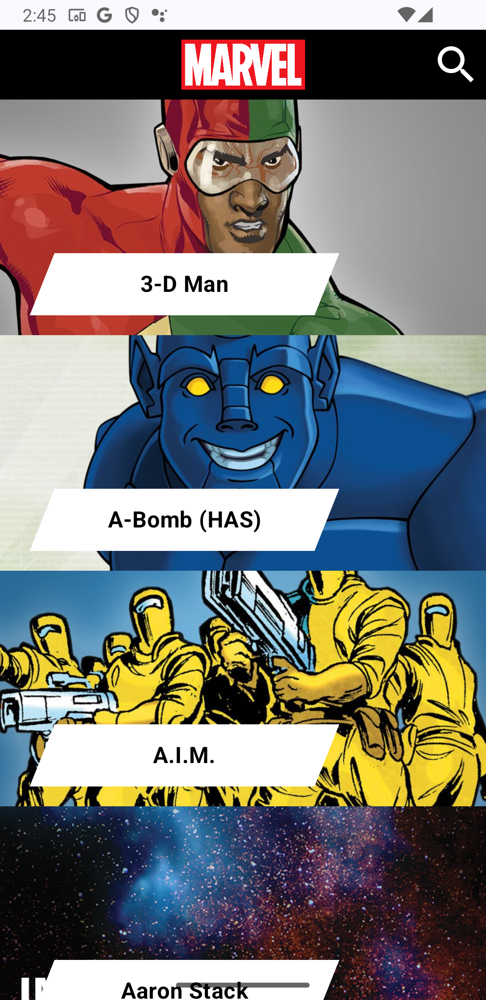
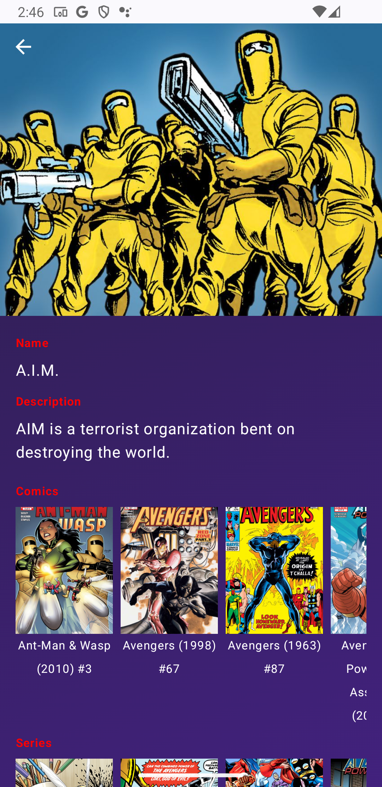
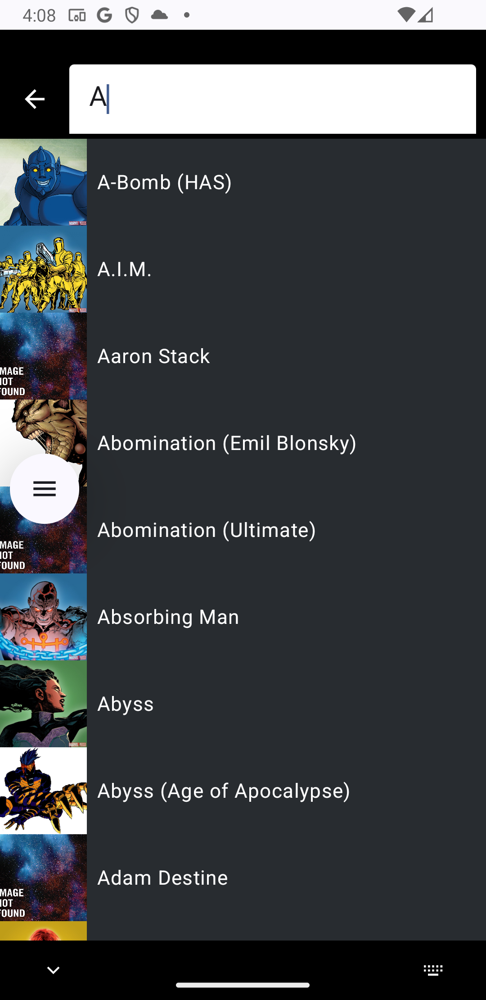

# Marvel Characters Library


**Marvel Characters Library** is an Android application that allows users to browse through the Marvel library of characters. The app connects to the Marvel API to fetch character data, including details such as comics, series, stories, and events. The app is built using modern Android development practices, including Jetpack Compose, MVVM architecture, and Hilt for dependency injection.

---

## Features

- **Browse Marvel Characters**: View a list of Marvel characters with infinite scroll pagination.
- **Character Details**: Tap on a character to view detailed information, including their description, comics, series, stories, and events.
- **Lazy-Loaded Images**: Images in the comics, series, stories, and events sections are lazy-loaded for better performance.
- **Search Functionality**: Search for characters by name (optional feature).
- **Responsive UI**: Follows Material Design guidelines with smooth animations and transitions.
- **Error Handling**: Displays appropriate error messages for network issues, API errors, and other exceptions.

---

## Architecture

The app follows the **MVVM (Model-View-ViewModel)** architectural pattern with a clean separation of concerns:

- **Data Layer**: Handles API calls and data caching using Retrofit and Gson.
- **Domain Layer**: Contains use cases and business logic.
- **Presentation Layer**: Built with Jetpack Compose, it includes UI components and ViewModels to manage UI state.

### Key Components

- **Jetpack Compose**: Used for building the UI in a declarative way.
- **Hilt**: For dependency injection.
- **Retrofit**: For making network requests to the Marvel API.
- **Coil**: For image loading and caching.
- **State Management**: Uses `StateFlow` and `MutableStateFlow` to manage UI state.
- **Navigation**: Uses Jetpack Navigation Compose for navigating between screens.

---

## Screenshots

| Character List | Character Details | Search |
|----------------|-------------------|-------------------|
|  |  |  |

---

## Code structure
```
Marvel-Characters-Library/
├── app/
│   ├── src/
│   │   ├── main/
│   │   │   ├── java/
│   │   │   │   ├── com.github.mohamedwael.marvelcharslibrary/
│   │   │   │   │   ├── characters/
│   │   │   │   │   │   ├── data/                # Data layer (API, repositories)
│   │   │   │   │   │   ├── domain/              # Domain layer (use cases, models)
│   │   │   │   │   │   ├── presentation/        # Presentation layer (ViewModels, UI)
│   │   │   │   │   ├── characterdetails/        # Character details feature
│   │   │   │   │   ├── di/                      # Dependency injection (Hilt)
│   │   │   │   │   ├── util/                    # Utility classes (error handling, navigation)
│   │   │   │   │   ├── ui/                      # UI components (Compose)
│   │   │   ├── res/                             # Resources (drawables, strings, etc.)
│   │   │   ├── AndroidManifest.xml              # App manifest
├── build.gradle                                 # Project-level build configuration

```

---
